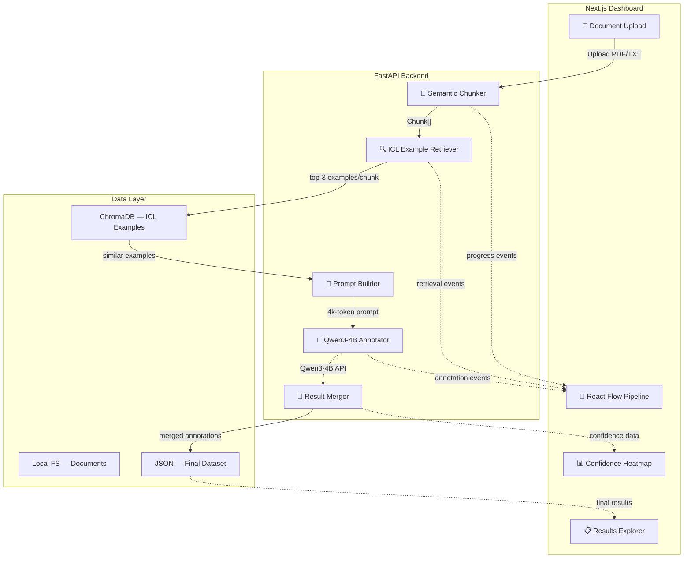
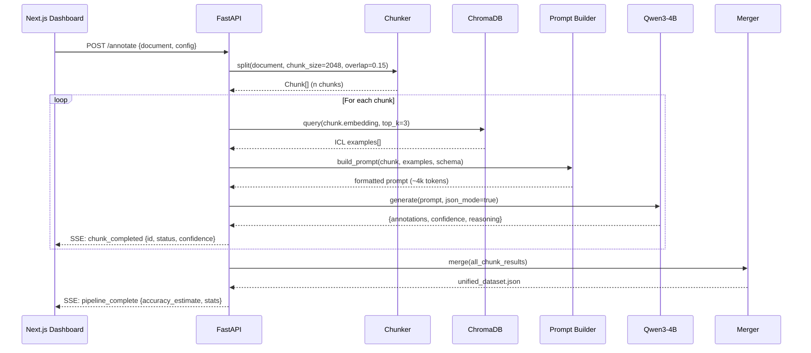

  
  <h1>ContextWeaver 🚀</h1>
  
<em>Dynamic In-Context Learning Router for Intelligent Data Annotation</em>

  
  
  
   
  
  
  
  
  
  
  
  

---

## 📸 See it in Action

*(Dashboard showcasing the live data annotation pipeline)*

## 💡 The Problem & Solution

In today's world, annotating long-context documents with smaller LLMs (like Qwen3-4B) fails due to lost-in-the-middle phenomena and context dilution from static few-shot examples. 

**ContextWeaver** solves this by reframing prompt construction as a retrieval problem—applying RAG to In-Context Learning itself. 

**Key Features:**
- ⚡ **Dynamic Retrieval:** For each document chunk, ChromaDB retrieves the top-3 most semantically relevant examples.
- 🎯 **Targeted Prompts:** Reduces a 100k-token monolithic prompt into focused ~4,000-token prompts per chunk.
- 🎨 **Visual Tracing:** A real-time Next.js and React Flow dashboard that animates data flow and provides a 3-column Chunk Inspector for total transparency.

## 🏗️ Architecture & Tech Stack

We built the frontend using **Next.js 16**, **React 19**, and **Tailwind CSS v4**, visualizing the pipeline with **React Flow**. The backend is powered by **Python FastAPI**, using **ChromaDB** and **sentence-transformers** for vector retrieval, and simulating the **Qwen3-4B** model for data annotation.

### System Architecture

### Data Flow — Annotation Pipeline

## 🏆 Sponsor Tracks Targeted

* **FlagOS Open Computing Global Challenge**: Submitted to **Track 3 — Automatic Data Annotation with Large Models in Long-Context Scenarios**. We effectively optimize the context window for Qwen3-4B.

**Jointly hosted by:**
* FlagOS Community
* Beijing Academy of Artificial Intelligence (BAAI)
* CCF Open Source Development Technology Committee (ODTC)

## 🚀 Run it Locally (For Judges)

We have made running the project as frictionless as possible. Just use the included Makefile:

1. **Clone the repo:** `git clone https://github.com/edycutjong/contextweaver.git`
2. **Navigate to directory:** `cd contextweaver`
3. **Install dependencies:** `make install`
4. **Run the app:** `make dev`

> **Note for Judges:** 
> The `make dev` command will start both the FastAPI backend (Port 8000) and the Next.js frontend (Port 3000) concurrently.
> Simply navigate to **http://localhost:3000** in your browser and click "Run Document Annotation" to see the live simulation!
