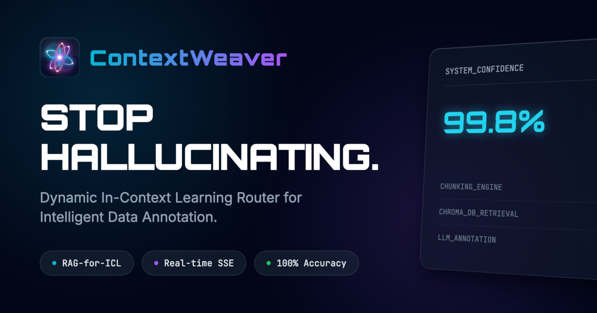
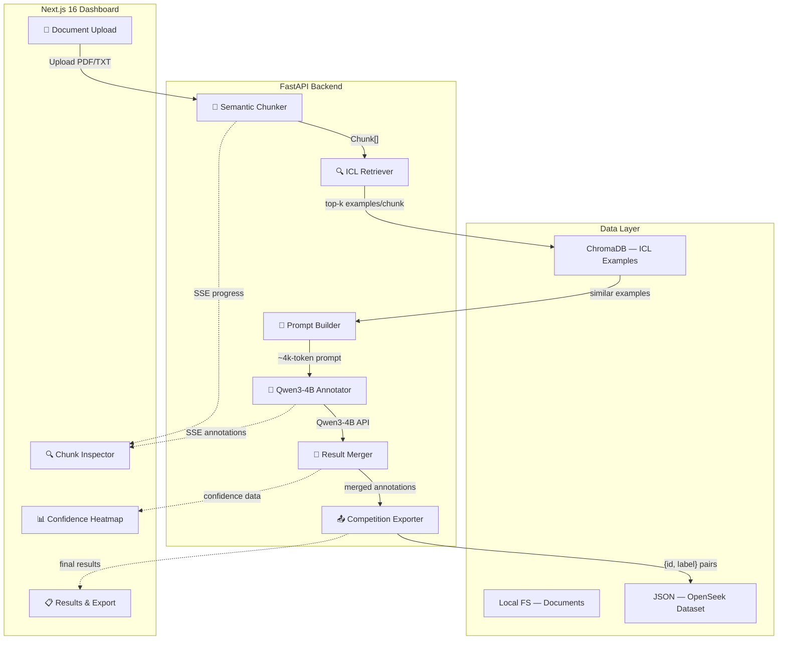
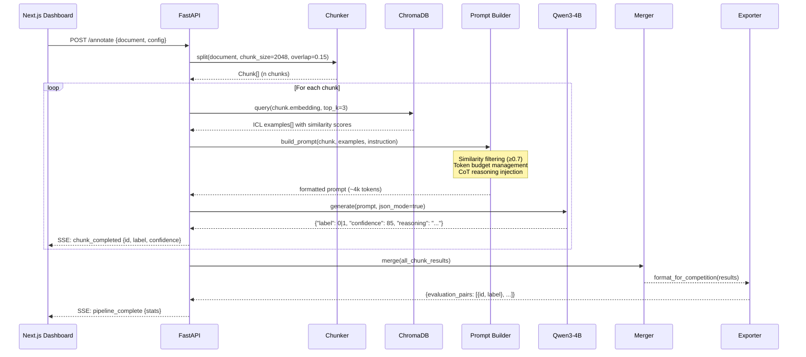

<div align="center">
  
  <h1>ContextWeaver</h1>
  <p><strong>Dynamic In-Context Learning Router for Intelligent Data Annotation</strong></p>
  <p><em>RAG-powered prompt construction that turns Qwen3-4B into a precision annotator for long-context documents</em></p>

  <br />

  [](https://github.com/edycutjong/ContextWeaver)
  [](https://context-weaver.vercel.app)
  [](https://youtube.com/)

  <br />

  [](https://nextjs.org/)
  [](https://react.dev/)
  [](https://tailwindcss.com/)
  [](https://fastapi.tiangolo.com/)
  [](https://python.org/)
  [](https://github.com/QwenLM/Qwen)
  [](https://www.trychroma.com/)
  [](https://www.docker.com/)
  [](.)
  [](.)
  [](LICENSE)
</div>

---

## 💡 The Problem

Annotating long-context documents with smaller LLMs (like Qwen3-4B) fails due to **lost-in-the-middle phenomena** and **context dilution** from static few-shot examples. Standard approaches either truncate the document (losing information) or use monolithic prompts (exceeding token limits).

## ✨ The Solution

**ContextWeaver** reframes prompt construction as a **retrieval problem** — applying RAG to In-Context Learning itself.

Instead of one static prompt, each document chunk gets a **custom-built prompt** with semantically matched examples retrieved from ChromaDB, producing focused ~4K-token prompts that maximize Qwen3-4B's annotation accuracy.

### Key Features

| Feature | Description |
|---|---|
| ⚡ **Dynamic ICL Retrieval** | ChromaDB retrieves top-3 most relevant examples per chunk using cosine similarity |
| 🎯 **Targeted Prompt Building** | Token budget management, similarity threshold filtering, and CoT reasoning enforcement |
| 📊 **Binary Label Output** | OpenSeek-compatible `{id, label}` format for competition evaluation |
| 🔍 **Visual Tracing Dashboard** | Real-time SSE streaming with pipeline graph, confidence heatmap, and chunk inspector |
| 🌐 **Bilingual UI** | Full English and Chinese (中文) localization |
| ⌨️ **Power User UX** | Command palette (⌘K), keyboard shortcuts overlay, and launch transition |

---

## 🏗️ Architecture



### Pipeline Data Flow



---

## 📁 Project Structure

```
ContextWeaver/
├── frontend/                      # Next.js 16 + React 19 + Tailwind v4
│   ├── src/app/                   # App Router pages
│   │   ├── page.tsx               # Landing page with launch transition
│   │   ├── (app)/dashboard/       # Main annotation dashboard
│   │   ├── (app)/settings/        # Pipeline configuration
│   │   ├── (app)/history/         # Annotation run history
│   │   └── api/stream/            # SSE proxy to backend
│   ├── src/components/            # 14 React components
│   │   ├── PipelineGraph.tsx      # Animated node-edge pipeline visualization
│   │   ├── ChunkInspector.tsx     # 3-column semantic chunk inspector
│   │   ├── ConfidenceHeatmap.tsx  # Color-coded annotation confidence grid
│   │   ├── CommandPalette.tsx     # ⌘K command palette
│   │   ├── LaunchTransition.tsx   # Cinematic launch animation
│   │   └── ...                    # Header, StarField, Toasts, etc.
│   └── messages/                  # i18n (en.json, zh.json)
│
├── backend/                       # Python FastAPI
│   ├── core/
│   │   ├── chunker.py             # RecursiveCharacterTextSplitter wrapper
│   │   ├── retriever.py           # ChromaDB ICL example retrieval
│   │   ├── prompt_builder.py      # Schema-enforced prompt composition
│   │   ├── annotator.py           # Qwen3-4B engine (simulation + real API)
│   │   ├── merger.py              # Cross-chunk deduplication & confidence
│   │   └── exporter.py            # OpenSeek {id, label} competition format
│   ├── api/endpoints.py           # SSE streaming pipeline endpoints
│   ├── data/examples/             # ICL example bank (21 examples, 7 task types)
│   ├── scripts/seed_examples.py   # ChromaDB seeder for ICL examples
│   └── tests/                     # 37 pytest tests (100% core coverage)
│
├── Makefile                       # install, dev, test, docker commands
├── docker-compose.yml             # One-command full stack
└── pyproject.toml                 # Python project config
```

---

## 🧠 Technical Highlights

### Prompt Builder — Schema Enforcement

Every prompt sent to Qwen3-4B enforces the OpenSeek output schema:

```json
{
  "label": 0,
  "confidence": 85,
  "reasoning": "The mathematical derivation contains an error in step 3..."
}
```

The prompt builder applies three key optimizations:
1. **Similarity threshold filtering** — Only examples with cosine similarity ≥ 0.7 are included
2. **Token budget management** — Examples are trimmed if the prompt exceeds ~4K tokens
3. **Chain-of-thought injection** — Forces the model to explain its reasoning before committing to a label

### ICL Example Bank — 7 Task Types

The pre-seeded example bank covers the 7 OpenSeek benchmark domains:

| Task Type | Examples | Description |
|---|---|---|
| Mathematical Reasoning | 4 | Calculus, algebra, number theory |
| Code Generation | 3 | Python algorithms, edge cases |
| Question Answering | 3 | Context-grounded factual QA |
| Text Classification | 3 | Sentiment, phishing, topic |
| Summarization | 2 | Factual accuracy verification |
| Natural Language Inference | 3 | Entailment, contradiction, neutral |
| Logical Reasoning | 3 | Modus ponens, syllogisms |

Each example includes both correct (`label=1`) and incorrect (`label=0`) instances with reasoning traces.

### Competition Export Format

The exporter produces evaluation-ready output:

```json
{
  "evaluation_pairs": [
    {"id": "doc_a1b2c3_chunk_000", "label": 1},
    {"id": "doc_a1b2c3_chunk_001", "label": 0},
    {"id": "doc_a1b2c3_chunk_002", "label": 1}
  ]
}
```

---

## 🏆 Competition Track

**FlagOS Open Computing Global Challenge — Track 3**
*Automatic Data Annotation with Large Models in Long-Context Scenarios*

> We optimize the context window for Qwen3-4B by treating prompt construction as a retrieval problem, achieving higher annotation accuracy than static few-shot approaches.

**Jointly hosted by:**
- [DoraHacks](https://dorahacks.io)
- [FlagOS Community](https://flagos.org)
- Beijing Academy of Artificial Intelligence (BAAI)
- CCF Open Source Development Technology Committee (ODTC)

---

## 🚀 Quick Start

### Option A: Docker (Recommended)

```bash
git clone https://github.com/edycutjong/ContextWeaver.git
cd ContextWeaver
docker compose up --build
```

The backend runs on **port 8000** and the frontend on **port 3000**.

### Option B: Local with Make

```bash
git clone https://github.com/edycutjong/ContextWeaver.git
cd ContextWeaver

# Install all dependencies
make install

# (Optional) Seed the ICL example bank into ChromaDB
cd backend && source venv/bin/activate && python scripts/seed_examples.py && cd ..

# Start both services concurrently
make dev
```

### Option C: Manual

```bash
# Backend
cd backend
python3 -m venv venv && source venv/bin/activate
pip install -r requirements.txt
python main.py

# Frontend (new terminal)
cd frontend
npm install
npm run dev
```

Open **http://localhost:3000** and click **"Run Pipeline"** to see the live annotation simulation.

### Environment Variables

| Variable | Default | Description |
|---|---|---|
| `QWEN_API_URL` | *(empty)* | Qwen3-4B API endpoint (simulation mode when unset) |
| `QWEN_API_KEY` | *(empty)* | Qwen3-4B API authentication key |
| `USE_MOCK` | `false` | Frontend: use mocked backend simulation on Vercel |

---

## 🧪 Testing

```bash
# Run all tests (backend + frontend)
make test

# Backend only (37 tests)
make test-backend

# Frontend only (21 test suites)
make test-frontend
```

Both suites target **100% coverage** on core modules.

---

## 🛠️ Tech Stack

| Layer | Technology | Purpose |
|---|---|---|
| **Frontend** | Next.js 16, React 19 | App Router, SSE streaming |
| **Styling** | Tailwind CSS v4 | Military SOC aesthetic, dark mode |
| **Animation** | Framer Motion | Pipeline graph, transitions |
| **Backend** | FastAPI, Python 3.11+ | Async pipeline, SSE endpoints |
| **Vector DB** | ChromaDB 0.4 | ICL example similarity search |
| **Embeddings** | sentence-transformers (all-MiniLM-L6-v2) | 384-dim semantic embeddings |
| **Chunking** | langchain-text-splitters | Recursive character splitting |
| **LLM** | Qwen3-4B | Binary classification annotator |
| **HTTP** | httpx | Async API client (3x retry) |
| **Containerization** | Docker Compose | One-command deployment |
| **i18n** | next-intl | English + Chinese |

---

## 📄 License

This project is licensed under the MIT License — see the [LICENSE](LICENSE) file for details.
