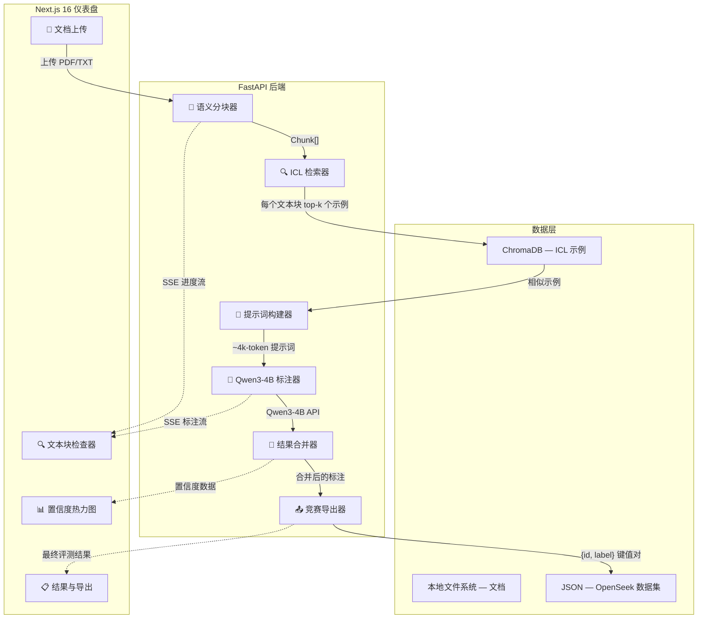
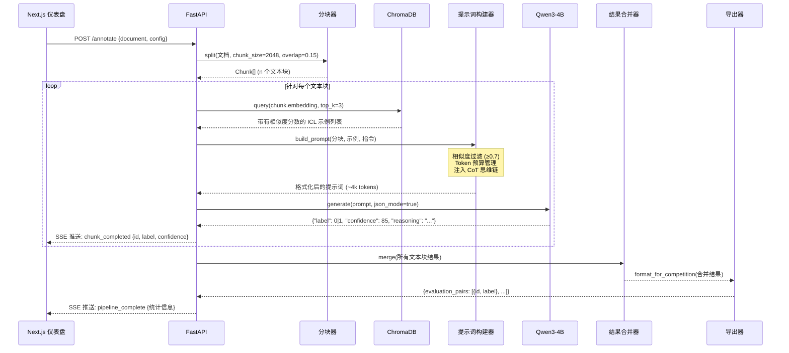

<div align="center">
  
  <h1>ContextWeaver</h1>
  <p><strong>用于智能数据标注的动态上下文学习（ICL）路由系统</strong></p>
  <p><em>基于 RAG 的提示词构建机制，将 Qwen3-4B 转化为处理长上下文文档的高精度标注器</em></p>

  <br />

  [](https://contextweaver.edycu.dev)
  [](https://youtu.be/n8CO_JNmunQ)
  [](https://dorahacks.io/buidl/43566)

  <br />

  [](https://nextjs.org/)
  [](https://react.dev/)
  [](https://tailwindcss.com/)
  [](https://fastapi.tiangolo.com/)
  [](https://python.org/)
  [](https://github.com/QwenLM/Qwen)
  [](https://www.trychroma.com/)
  [](https://www.docker.com/)
  [](https://github.com/edycutjong/ContextWeaver/actions)
  [](README.md)
  [](LICENSE)
</div>

---

## 💡 痛点问题

使用较小参数量的大语言模型（如 Qwen3-4B）来标注长上下文文档时，通常会因为**“中间迷失”（lost-in-the-middle）现象**以及静态少样本（few-shot）示例带来的**上下文稀释**而面临失败。标准的处理方法要么是截断文档（导致丢失信息），要么是使用单一庞大的提示词（导致超出 Token 限制）。

## ✨ 解决方案

**ContextWeaver** 将提示词构建重构为一个**检索问题** — 将 RAG 技术应用于上下文学习 (In-Context Learning) 本身。

系统不再使用一个静态的提示词，而是为每一个文档块**定制构建提示词**，通过 ChromaDB 检索语义匹配的示例。由此生成专注的、长度约 4K Token 的提示词，能够最大化 Qwen3-4B 的标注准确率。

### 核心特性

| 特性 | 描述 |
|---|---|
| ⚡ **动态 ICL 检索** | ChromaDB 通过余弦相似度为每个文本块检索 top-3 最相关的示例 |
| 🎯 **精准构建提示词** | 包含 Token 预算管理、相似度阈值过滤以及强制 CoT 思维链推理 |
| 📊 **二元标签输出** | 兼容 OpenSeek 的 `{id, label}` 格式，专为竞赛评测设计 |
| 🔍 **可视化追踪大屏** | 实时 SSE 流传输，包含流水线图表、置信度热力图和分块检查器 |
| 🌐 **双语用户界面** | 全面支持英文和中文 (中文) 国际化本地化 |
| ⌨️ **极客级交互体验** | 快捷命令面板 (⌘K)、键盘快捷键覆盖层和沉浸式启动转场 |

---

## 🏗️ 架构设计



### 流水线数据流向



---

## 📁 项目结构

```text
ContextWeaver/
├── frontend/                      # Next.js 16 + React 19 + Tailwind v4
│   ├── src/app/                   # App Router 页面路由
│   │   ├── page.tsx               # 带有启动过渡动画的着陆页
│   │   ├── (app)/dashboard/       # 主数据标注仪表盘
│   │   ├── (app)/settings/        # 流水线全局配置
│   │   ├── (app)/history/         # 历史标注运行记录
│   │   └── api/stream/            # 代理后端的 SSE 流媒体接口
│   ├── src/components/            # 14 个核心 React 组件
│   │   ├── PipelineGraph.tsx      # 流水线节点-连接线可视化动画图
│   │   ├── ChunkInspector.tsx     # 三栏式语义文本块检查器
│   │   ├── ConfidenceHeatmap.tsx  # 色彩编码的标注置信度网格
│   │   ├── CommandPalette.tsx     # ⌘K 全局快捷命令面板
│   │   ├── LaunchTransition.tsx   # 沉浸式应用启动转场动画
│   │   └── ...                    # 顶部导航栏, 星空背景, Toast 提示等
│   └── messages/                  # i18n 国际化配置 (en.json, zh.json)
│
├── backend/                       # Python FastAPI 后端
│   ├── core/
│   │   ├── chunker.py             # 递归字符文本分割器封装
│   │   ├── retriever.py           # ChromaDB ICL 示例检索器
│   │   ├── prompt_builder.py      # Schema 强制约束的提示词组合器
│   │   ├── annotator.py           # Qwen3-4B 引擎 (支持离线模拟与真实 API 调用)
│   │   ├── merger.py              # 跨文本块去重与置信度整合
│   │   └── exporter.py            # OpenSeek {id, label} 竞赛格式导出器
│   ├── api/endpoints.py           # SSE 流式传输 API 端点接口
│   ├── data/examples/             # ICL 示例库 (21 个示例, 覆盖 7 大任务)
│   ├── scripts/seed_examples.py   # ChromaDB ICL 示例向量化播种脚本
│   └── tests/                     # 37 个 pytest 测试用例 (核心模块 100% 覆盖)
│
├── Makefile                       # install, dev, test, docker 快捷命令
├── docker-compose.yml             # 全栈一键启动容器编排配置
└── pyproject.toml                 # Python 项目工程配置
```

---

## 🧠 技术亮点

### 提示词构建器 — 强制结构输出 (Schema Enforcement)

发送给 Qwen3-4B 的每一个提示词，都会在系统层面严格强制执行 OpenSeek 输出规范：

```json
{
  "label": 0,
  "confidence": 85,
  "reasoning": "第三步的数学推导中存在错误..."
}
```

提示词构建器在此基础上应用了三大核心优化策略：
1. **相似度阈值过滤** — 仅保留余弦相似度 ≥ 0.7 的示例
2. **Token 预算管理** — 若提示词总长濒临 ~4K Tokens 上限，系统将自动截断或移除多余示例
3. **注入思维链 (CoT)** — 强制模型在输出最终标签 (label) 前，先利用推理字段解释其逻辑过程

### ICL 示例库 — 覆盖 7 大任务类型

系统内预置的示例库全面覆盖了 OpenSeek 基准评测规范的 7 大核心领域：

| 任务类型 | 示例数 | 考察场景描述 |
|---|---|---|
| 数学推理 (Mathematical Reasoning) | 4 | 微积分、代数、数论 |
| 代码生成 (Code Generation) | 3 | Python 算法逻辑、边界用例 |
| 问答匹配 (Question Answering) | 3 | 基于上下文的事实核查式问答 |
| 文本分类 (Text Classification) | 3 | 情感分析、钓鱼预测、主题分类 |
| 文本摘要 (Summarization) | 2 | 事实准确性验证 |
| 自然语言推理 (Natural Language Inference) | 3 | 蕴含、矛盾、中立 |
| 逻辑推理 (Logical Reasoning) | 3 | 肯定前件式 (Modus ponens)、三段论 |

每个领域的样本均包含正确（`label=1`）和错误（`label=0`）的实例，并完整记录了规范的推理思维链轨迹。

### 竞赛专属导出格式

导出器可一键生成用于比赛平台最终评测验证的标准化数据：

```json
{
  "evaluation_pairs": [
    {"id": "doc_a1b2c3_chunk_000", "label": 1},
    {"id": "doc_a1b2c3_chunk_001", "label": 0},
    {"id": "doc_a1b2c3_chunk_002", "label": 1}
  ]
}
```

---

## 🏆 挑战赛赛道

**FlagOS智算开源全球挑战赛 — 赛道 3**
*长上下文场景中大模型自动数据标注*

> 我们通过将提示词的构建重塑为一个数据检索问题，极大优化了 Qwen3-4B 处理长文本的上下文窗口能力，相较于传统的静态少样本（Few-shot）方案，实现了更高的标注准确率。

**联合主办单位：**
- [DoraHacks](https://dorahacks.io)
- [众智FlagOS社区](https://flagos.org)
- 北京智源人工智能研究院 (BAAI)
- CCF开源发展委员会 (ODTC)

---

## 🚀 快速开始

### 选项 A：使用 Docker 部署（推荐）

```bash
git clone https://github.com/edycutjong/ContextWeaver.git
cd ContextWeaver
docker compose up --build
```

启动后，后端服务将运行在 **8000 端口**，前端界面运行在 **3000 端口**。

### 选项 B：使用 Make 本地构建

```bash
git clone https://github.com/edycutjong/ContextWeaver.git
cd ContextWeaver

# 安装前后端所有依赖
make install

# (可选操作) 将 ICL 示例库注入到本地 ChromaDB 中
cd backend && source venv/bin/activate && python scripts/seed_examples.py && cd ..

# 并发启动前端和后端开发服务器
make dev
```

### 选项 C：手动启动服务

```bash
# 后端启动
cd backend
python3 -m venv venv && source venv/bin/activate
pip install -r requirements.txt
python main.py

# 前端启动 (请打开新的终端窗口)
cd frontend
npm install
npm run dev
```

在浏览器打开 **http://localhost:3000** 并点击 **"Run Pipeline"** 即可体验实时标注模拟过程。

### 环境变量参考

| 变量名 | 默认值 | 说明 |
|---|---|---|
| `QWEN_API_URL` | *(空)* | Qwen3-4B 的 API 调用地址（未设置时默认进入离线模拟模式） |
| `QWEN_API_KEY` | *(空)* | Qwen3-4B 的 API 鉴权密钥 |
| `USE_MOCK` | `false` | 前端配置: 在 Vercel 等无法连接后端时使用，开启虚拟流数据模式 |

---

## 🧪 测试

```bash
# 运行所有测试套件 (后端 + 前端)
make test

# 仅运行后端测试 (37 个测试用例)
make test-backend

# 仅运行前端测试 (21 个测试套件)
make test-frontend
```

前后端的单元测试均保证了核心模块代码达到 **100% 测试覆盖率**。

---

## 🛠️ 技术栈清单

| 层级 | 核心技术 | 实际用途 |
|---|---|---|
| **前端架构** | Next.js 16, React 19 | App Router 路由控制, SSE 实时数据流渲染传输 |
| **页面样式** | Tailwind CSS v4 | 军事/网络安全中心 (SOC) 级极客美学，原生暗黑模式 |
| **动画交互** | Framer Motion | 流水线节点动效，平滑的页面视图转场 |
| **后端框架** | FastAPI, Python 3.11+ | 异步处理流水线引擎，SSE 服务器端点响应 |
| **向量数据库** | ChromaDB 0.4 | 存储与检索高维空间中的 ICL 示例相似度 |
| **嵌入模型** | sentence-transformers (all-MiniLM-L6-v2) | 极速轻量的 384 维语义向量生成 |
| **文本分块** | langchain-text-splitters | 带重叠机制的递归字符级文档分割 |
| **大语言模型** | Qwen3-4B | 竞赛指定的基座模型，负责二元分类标注推理 |
| **网络请求** | httpx | 异步 API 客户端（内置 3 次容错重试机制） |
| **容器化** | Docker Compose | 屏蔽底层环境差异，支持全栈一键编排部署 |
| **国际化 (i18n)** | next-intl | 完整的英文与中文无缝切换体验 |

---

## 🤝 赞助商与合作伙伴

<div align="center">

专为 **[FlagOS智算开源全球挑战赛](https://dorahacks.io/hackathon/flagos)** 打造 — 赛道 3

| | 合作伙伴 | 角色担当 |
|---|---|---|
| 🏆 | **[DoraHacks](https://dorahacks.io)** | 黑客松赛事平台与赏金基础设施提供方 |
| 🚩 | **[众智FlagOS社区](https://flagos.org)** | 开放计算生态核心圈与挑战赛主办方 |
| 🧠 | **[BAAI](https://www.baai.ac.cn/)** | 北京智源人工智能研究院 |
| 📋 | **[CCF ODTC](https://www.ccf.org.cn/)** | CCF开源发展委员会 |
| 📦 | **[OpenSeek](https://github.com/openai/openai-cookbook)** | 数据集来源与最终评测格式规范制定方 |
| 🤖 | **[Qwen (阿里通义千问)](https://github.com/QwenLM/Qwen)** | Qwen3-4B 大语言模型基座支持方 |
| 🔍 | **[ChromaDB](https://www.trychroma.com/)** | 支撑高效 ICL 示例检索的向量数据库 |
| 🧩 | **[sentence-transformers](https://www.sbert.net/)** | 轻量精准的 all-MiniLM-L6-v2 嵌入模型 |

</div>

---

## 📄 许可证

本项目基于 MIT 许可证进行开源 — 详细内容请查阅 [LICENSE](LICENSE) 授权文件。